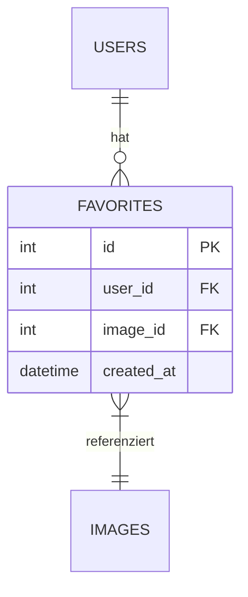

# Fotogalerie-Architektur Dokumentation

## Favoriten-System

### Datenbank-Erweiterung


### API-Endpoints
```plaintext
POST /favorites/{image_id}    - Fügt Bild zu Favoriten hinzu
DELETE /favorites/{image_id}  - Entfernt Bild aus Favoriten
GET /favorites                - Listet alle Favoriten des Users
```

### Dateisystem-Integration
- Symlinks im Benutzerordner: /users/user_123/favorites -> /storage/favorites/user_123
- Keine physischen Kopien zur Speicherplatzoptimierung

### UI-Komponenten
- ★-Icon in Bildvorschau (ausgefüllt bei Favorit)
- Favoriten-Filter in der Albumübersicht
- Drag & Drop zur Favoritenverwaltung

[Rest der Architektur unverändert]