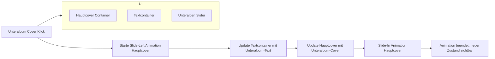

# Plan zur Umsetzung der Slide-Animation für Unteralben-Cover in album.php

## Ziel
Beim Klick auf ein Unteralbum soll das Hauptcover nach links sliden (mit Animation) und der Text des Unteralbums angezeigt werden. Die Ansicht soll so aussehen:

```
Haupt Cover - Unteralbum Cover Text - nächstes Unteralbum Cover
```

## Vorgehen



## Details

- HTML:
  - Hauptcover in einem Container mit CSS-Klassen für Animation.
  - Textcontainer für Albumname und Beschreibung.
  - Unteralben als Slider (Swiper) bleiben sichtbar.

- CSS:
  - Definieren von Keyframe-Animationen für Slide-Left und Slide-In.
  - Übergänge für Textwechsel.

- JavaScript:
  - Event-Listener auf Unteralbum-Cover.
  - Steuerung der Animationen und dynamisches Aktualisieren von Cover und Text.

## Nächste Schritte

- Implementierung der CSS-Animationen.
- Anpassung der HTML-Struktur in album.php.
- JavaScript für Animation und dynamischen Textwechsel schreiben.